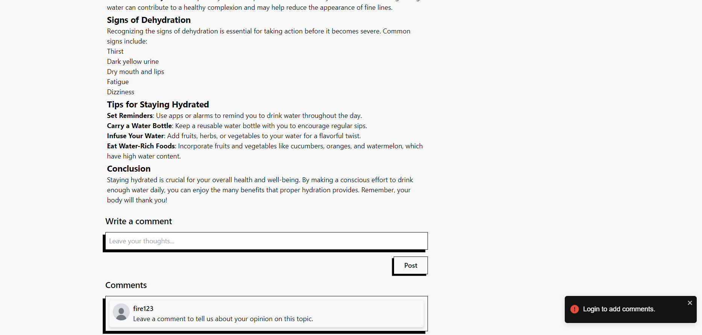

# Blogify

## Overview

**Blogify** is a dynamic blogging platform designed to create an interactive space for users to share their thoughts and engage with a community. With a unique and fully responsive UI, Blogify allows users to create, comment on, and like posts, all while managing their content through an intuitive dashboard.

## Features

- **User Registration and Login**: Secure user authentication using JWT, with passwords stored in hashed form using bcrypt.
- **Rich Blog Creation**: Users can create blogs using React Quill, enabling easy formatting with a graphical user interface (GUI) without needing to write HTML or Markdown.
- **Image Uploads**: Users can upload images as thumbnails for their blogs.
- **Comments and Likes**: Engage with others by commenting on and liking posts.
- **Dashboard**: 
  - Full control of user accounts with options to edit or delete blogs.
  - View performance analytics over the last 10 days with graphs powered by Chart.js.
  - Notifications with timestamps indicating who interacted with the user's posts.
- **Tags and Search**: Blogs can be tagged (e.g., business, education, tech), helping users easily find content relevant to their interests. A search function allows users to find blogs based on keywords.
- **Infinite Scroll**: Efficiently loads data as the user scrolls, preventing overload when large amounts of data are present.

## Technology Stack

- **Frontend**: React.js, Tailwind CSS
- **Backend**: Node.js, Express.js
- **Database**: MongoDB (managed with Mongoose)
- **Additional Libraries**:
  - React Quill for blog formatting
  - Chart.js for data visualization
  - DOM Purify for sanitizing react-quill user input to prevent XSS attacks
  - React Type Animation for home page animations
  - React Toastify for notifications
  - React Infinite Scroll for dynamic data fetching

## Screenshots





## Installation

To run Blogify on your local system, follow these steps:

1. **Clone the repository**:
   ```bash
   git clone https://github.com/MuhammadAli990/mern-blog-website
   cd blogify
2. **Install dependencies**: Navigate to both the frontend and backend directories and run:
```npm install```
3. **Run the frontend application**:
```npm run build```
4. **Start the backend server**:
```node server.js```

## Usage
1. **Creating an Account**: Users can register through the sign-up form.
2. **Creating Blogs**: Access the blog creation page to format and publish posts easily.
3. **Interacting with Blogs**: Users can like or comment on other blogs.
4. **Dashboard Management**: The dashboard provides analytics, blog management, and notifications.
## Contributing
Feedback and contributions are welcomed! If you find any bugs or errors, feel free to submit a pull request.

## Contact
For questions or feedback, please reach out via GitHub.
